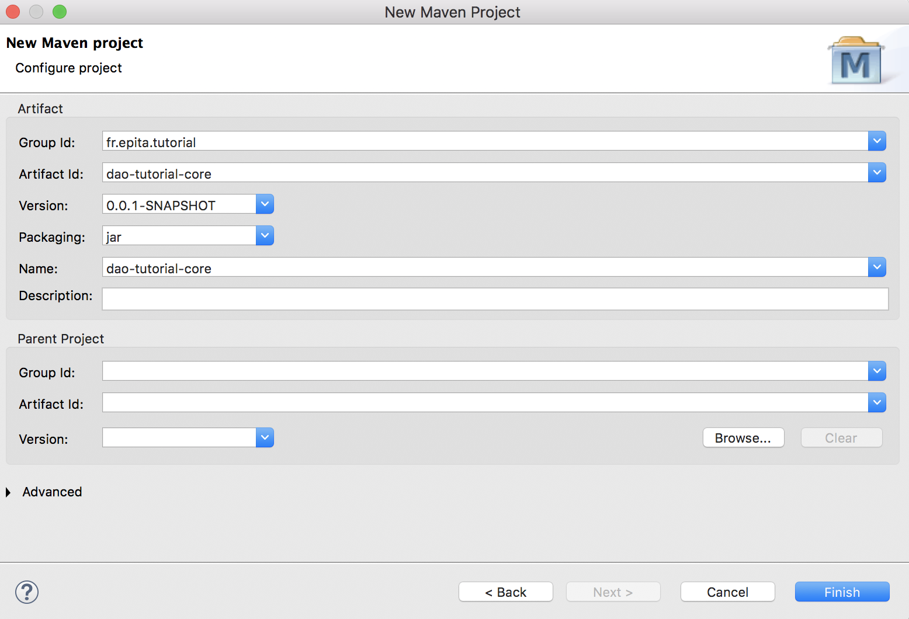
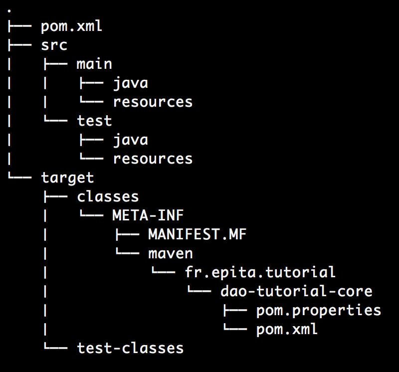
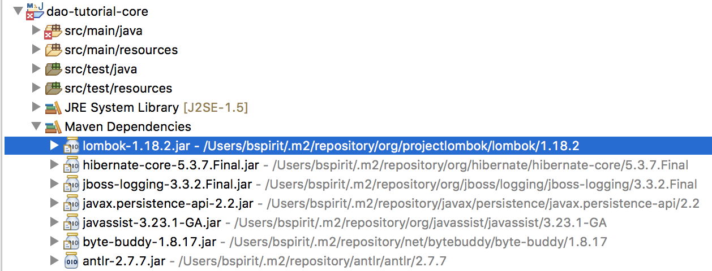
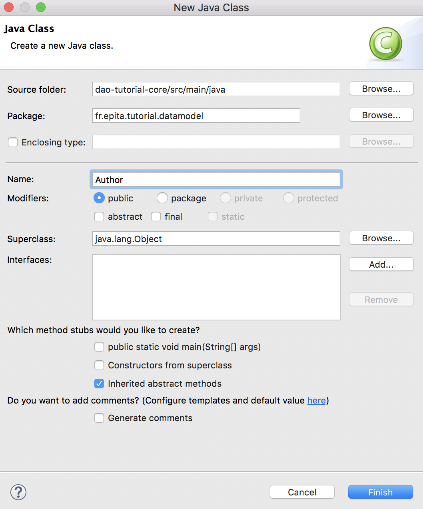

# How to create a DAO using JPA

The purpose of this tutorial is to implement the DAO design pattern using Java and the JPA API.

All of the following code can be found in my public repository:

<a href="https://bitbucket.org/BSpirit/dao-tutorial-core/src/master/">https://bitbucket.org/BSpirit/dao-tutorial-core/src/master/</a>

## 1. Project Set up

In this part, we are going to set up the Java project using Eclipse IDE and Apache Maven software.

### 1.1. Tools

- **Eclipse IDE**

Eclipse is a popular IDE used in Java programming.

<a href="https://www.eclipse.org/downloads/">https://www.eclipse.org/downloads/</a>

- **Maven**

Apache Maven is a software project management and comprehension tool. Based on the concept of a Project Object Model (POM), Maven can manage a project's build, reporting and documentation from a central piece of information.

Its main purpose for this tutorial will be to handle dependencies between librairies.

<a href="https://maven.apache.org/">https://maven.apache.org/</a>

### 1.2. Create new project

Open Eclipse IDE and create a new Maven Project: `File -> New -> Maven Project`

- You may check `Create a simple project` option. This will create a basic, Maven-enabled Java project. If you require a more advanced setup, leave this setting unchecked, and you will be able to use more advanced Maven project setup features. Then, click `next`.
- Fill up new project informations, then click `finish`.

<p align="center">

</p>

- The structure of a Maven Based project is as follow:

<p align="center">

</p>

### 1.3. Adding dependencies

The dependencies of the project can be found in the `pom.xml` file located at the root of the project. To begin with, we are going to add `Lombok` and `Hibernate` dependencies:

- To include lombok, add it to your `<dependencies>` block like so:
```xml
<dependency>
    <groupId>org.projectlombok</groupId>
    <artifactId>lombok</artifactId>
    <version>1.18.2</version>
    <scope>provided</scope>
</dependency>
```

- To include Hibernate, add it to your `<dependencies>` block like so:
```xml
<dependency>
    <groupId>org.hibernate</groupId>
    <artifactId>hibernate-core</artifactId>
    <version>5.3.7.Final</version>
</dependency>
```

- To force the project to compile using Java 8, you should also add this:
```xml
<properties>
    <maven.compiler.source>1.8</maven.compiler.source>
    <maven.compiler.target>1.8</maven.compiler.target>
</properties>
```

- Your final `pom.xml` file should look like this:
```xml
<project xmlns="http://maven.apache.org/POM/4.0.0"
    xmlns:xsi="http://www.w3.org/2001/XMLSchema-instance"
    xsi:schemaLocation="http://maven.apache.org/POM/4.0.0 
    http://maven.apache.org/xsd/maven-4.0.0.xsd">

    <modelVersion>4.0.0</modelVersion>
    <groupId>fr.epita.tutorial</groupId>
    <artifactId>dao-tutorial-core</artifactId>
    <version>0.0.1-SNAPSHOT</version>
    <name>dao-tutorial-core</name>

    <properties>
        <maven.compiler.source>1.8</maven.compiler.source>
        <maven.compiler.target>1.8</maven.compiler.target>
    </properties>

    <dependencies>
        <dependency>
            <groupId>org.projectlombok</groupId>
            <artifactId>lombok</artifactId>
            <version>1.18.2</version>
            <scope>provided</scope>
        </dependency>

        <dependency>
            <groupId>org.hibernate</groupId>
            <artifactId>hibernate-core</artifactId>
            <version>5.3.7.Final</version>
        </dependency>
    </dependencies>

</project>
```

- Once the dependency is added, you must use `maven install` command to set the project. In eclipse, you can right click on the `pom.xml` file located at the root of the project and go to `Run As -> Maven install`.

**NOTE**: When adding new dependencies, you may right click on the root of the project and go to `Maven -> Update Project` to get the new dependencies.

### 1.4. Lombok installation

- Once the jar was downloaded in your local repository, go to the jar location from command prompt. If you are not sure where to find it, the path is specified in Eclipse:

<p align="center">

</p>

- Then use `java -jar lombok-1.18.2.jar` to pursue Lombok installation. You may have to restart Eclipse.

## 2. Entities

Entities are POJO (Plain Old Java Object) class whose main purpose is to be mapped to relationnal database tables. In this part of the tutorial, we will use JPA API (thanks to Hibernate) and Lombok to easily create Entity classes.

### 2.1. Tools

- **Project Lombok**

Project Lombok is a java library that automatically plugs into your editor and build tools, spicing up your java.

<a href="https://projectlombok.org/">https://projectlombok.org/</a>

- **Hibernate**

Java Persistence API purpose is to persistently store the vast amounts of data into a database. 
Using JPA, the burden of interacting with the database reduces significantly. It forms a bridge between object models (Java program) and relational models (database program).

In this tutorial, we will use Hibernate ORM, as it is also an implementation of the Java Persistence API (JPA) specification.

<a href="http://hibernate.org/orm/">http://hibernate.org/orm/</a>

### 2.2. Let's write some code !

To illustrate the DAO design pattern, we are first going to create two entities, an Author entity and a Book entity.
Using `Javax.persistence` and `Lombok`, the code is very simple.

- First, let's create our Author class inside a `fr.epita.tutorial.datamodel` package. Right click on `src/main/java` and go to `new -> Class`. 

<p align="center">

</p>

The code of the Author class is as simple as this !

```java
@Entity
@Data
public class Author {
    @Id
    @GeneratedValue(strategy=GenerationType.AUTO)
    private Long id;
    private String firstName;
    private String lastName;
}
```

The code of the Book class is as easy to write:

```java
@Entity
@Data
public class Book {
    @Id
    @GeneratedValue(strategy=GenerationType.AUTO)
    private Long id;
    
    private String title;
    
    @ManyToOne
    private Author author;
}
```

In these examples, several annotations are used to avoid writing redondant code:

- `@Data` is a Lombok annotation and allows auto generation of setters/getters and other utilities function such as `toString`, `hashCode` or `equals`
- `@Entity` is used to create the binding between our class and the DB table
- `@Id` is used to specify which attribut is used as an ID inside the DB table
- `@ManyToOne` is used to specify the relation between our Book class and our Author class (this will also impact the DB tables)

## 3. DAO

The Data Access Object (DAO) pattern is a structural pattern that allows isolation of the application/business layer from the persistence layer (usually a relational database, but it could be any other persistence mechanism) using an abstract API.

The functionality of this API is to hide from the application all the complexities involved in performing CRUD operations in the underlying storage mechanism. This permits both layers to evolve separately without knowing anything about each other.

In this part of the tutorial, we will create simple DAOs allowing an easy access to our DB entities.
We will also use dependency injection to help us instanciate the `DriverManagerDataSource` and the `SessionFactory` objects, which are both necessary to handle the DB connection.

### 3.1. Tools

- **Log4j**

Apache Log4j is a Java-based logging utility. It can be used to help debugging the application if necessary.
It can be added as a maven dependency by updating your `pom.xml` file:
```xml
<dependency>
    <groupId>org.apache.logging.log4j</groupId>
    <artifactId>log4j-api</artifactId>
    <version>2.11.1</version>
</dependency>

<dependency>
    <groupId>org.apache.logging.log4j</groupId>
    <artifactId>log4j-core</artifactId>
    <version>2.11.1</version>
</dependency>
```

To use Log4j, you have to create a configuration file. Create a file called `log4j2.xml` in `src/test/resources/` and add this content:
```xml
<?xml version="1.0" encoding="UTF-8"?>
<Configuration status="WARN">
  <Appenders>
    <Console name="Console" target="SYSTEM_OUT">
      <PatternLayout 
        pattern="%d{HH:mm:ss.SSS} [%t] %-5level %logger{36} - %msg%n"/>
    </Console>
  </Appenders>
  <Loggers>
    <Root level="info">
      <AppenderRef ref="Console"/>
    </Root>
  </Loggers>
</Configuration>
```

<a href="https://logging.apache.org/log4j/2.x/">https://logging.apache.org/log4j/2.x/</a>

- **Spring Framework**

The Spring Framework is an application framework. In this part of the tutorial, it will be used for dependency injection using `@inject` annotation from `javax.injection`.
These can be added as maven dependencies by updating your `pom.xml` file:
```xml
<dependency>
    <groupId>javax.inject</groupId>
    <artifactId>javax.inject</artifactId>
    <version>1</version>
</dependency>

<dependency>
    <groupId>org.springframework</groupId>
    <artifactId>spring-test</artifactId>
    <version>5.0.9.RELEASE</version>
    <scope>test</scope>
</dependency>

<dependency>
    <groupId>org.springframework</groupId>
    <artifactId>spring-core</artifactId>
    <version>5.0.9.RELEASE</version>
</dependency>

<dependency>
    <groupId>org.springframework</groupId>
    <artifactId>spring-context</artifactId>
    <version>5.0.9.RELEASE</version>
</dependency>

<dependency>
    <groupId>org.springframework</groupId>
    <artifactId>spring-orm</artifactId>
    <version>5.0.9.RELEASE</version>
</dependency>
```

<a href="https://spring.io/">https://spring.io/</a>

### 3.2. Let's write some code !

- First, let's create, inside a `fr.epita.tutorial.datamodel` package, a generic DAO able to perform basic CRUD operations. Right click on `src/main/java` and go to `new -> Class`. The DAO code is as follow:
```java
public abstract class DAO<T> {

    protected static final Logger LOGGER = LogManager.getLogger(DAO.class);
    protected Class<T> modelClass;

    @Inject
    @Named("sessionFactory")
    private SessionFactory sf;

    public void setmodelClass(Class<T> modelClass) {
        this.modelClass = modelClass;
    }

    protected final Session getSession() {
        Session session = null;
        try {
            session = this.sf.getCurrentSession();
        } catch (Exception e) {
            LOGGER.error(e);
        }

        if (session == null)
            session = sf.openSession();

        return session;

    }

    protected final Transaction getTransaction(Session session) {
        Transaction tx = session.getTransaction();
        if (!TransactionStatus.ACTIVE.equals(tx.getStatus()))
            tx = session.beginTransaction();

        return tx;
    }

    public final Long create(T obj) {
        Session session = this.getSession();
        Transaction tx = this.getTransaction(session);
        Long id = (Long) session.save(obj);
        tx.commit();
        return id;
    }

    public final void delete(T obj) {
        Session session = this.getSession();
        Transaction tx = this.getTransaction(session);
        session.delete(obj);
        tx.commit();
    }

    public final void update(T obj) {
        Session session = this.getSession();
        Transaction tx = this.getTransaction(session);
        session.update(obj);
        tx.commit();
    }

    public T getById(Long id) {
        return getSession().get(modelClass, id);
    }

    @SuppressWarnings("unchecked")
    public List<T> getAll() {
        return getSession().createQuery("from " + 
            modelClass.getName()).list();
    }
    
    public abstract List<T> search(T criteria);
}
```

In the previous exemple:

- The `SessionFactory` object is used to create Sessions and Transactions with the DB. We will see later how to configure it.
- `getSession` and `getTransaction` methods are used to avoid Sessions or Transactions duplication.
- `create`, `update`, `update`, `getById` and `getAll` methods perform the basic CRUD actions. As you can, we don't even need to know what the data looks like thanks to genericity.

Because this DAO class is abstract, it cannot be instantiated. Specific DAOs must be created for each entity and can be used to specify some behaviors, which might depends on the entity itself:

- **AuthorDAO**:
```java
@Repository
public class AuthorDAO extends DAO<Author> {

    public AuthorDAO() {
        this.setmodelClass(Author.class);
    }

    @Override
    public List<Author> search(Author criteria) {
        String searchQuery = "from Author as a " +
            "where a.firstName like :firstName or " +
            "a.lastName like :lastName";
        Session session = this.getSession();
        Query<Author> query = session.createQuery(searchQuery, Author.class);
        query.setParameter("firstName", "%" + criteria.getFirstName() + "%");
        query.setParameter("lastName", "%" + criteria.getLastName() + "%");
        return query.list();
    }
}
```

- **BookDAO**:
```java
@Repository
public class BookDAO extends DAO<Book> {
    
    public BookDAO() {
        this.setmodelClass(Book.class);
    }

    @Override
    public List<Book> search(Book criteria) {
        String searchQuery = "from Book where author = :author";
        Query<Book> query = getSession().createQuery(searchQuery, Book.class);
        query.setParameter("question", criteria.getAuthor());
        return query.list();
    }
}
```

In the previous examples:

- We use a create a query using HQL (Hibernate Query Language) and the `Query` object.
- We use `setParameter` to make a binding using the criteria variable.
- We return the result of the `Query` as a list.
- The `@Repository` annotation is needed by Spring Framework when creating a DAO class. For more details, check Spring Framework documentation.

### 3.3. Use dependency injection

The `BookDAO` and `AuthorDAO` are both using dependency injection to instantiate the `SessionFactory` object. As a result, these objects have to be managed by the Spring IoC container. These objects can be refered as "beans". These beans are created with the configuration metadata supplied, for example using an XML file.

Let's create this XML file:

- Create a file called `applicationContext.xml` in `src/test/resources` and add this content inside:

```xml
<beans xmlns="http://www.springframework.org/schema/beans"
    xmlns:xsi="http://www.w3.org/2001/XMLSchema-instance"
    xmlns:context="http://www.springframework.org/schema/context"
    xmlns:mvc="http://www.springframework.org/schema/mvc"
    xsi:schemaLocation="http://www.springframework.org/schema/beans
    http://www.springframework.org/schema/beans/spring-beans.xsd
    http://www.springframework.org/schema/context
    http://www.springframework.org/schema/context/spring-context.xsd
    http://www.springframework.org/schema/mvc
    http://www.springframework.org/schema/mvc/spring-mvc.xsd">
    
    <context:component-scan 
    base-package="fr.epita.tutorial.services.data"/>

    <bean id="dataSource"
    class="org.springframework.jdbc.datasource.DriverManagerDataSource">
        <property 
            name="url" 
            value="jdbc:h2:mem:test;DB_CLOSE_DELAY=-1">
        </property>
        <property 
            name="username" 
            value="test">
        </property>
        <property 
            name="password" 
            value="test">
        </property>
        <property 
            name="driverClassName" 
            value="org.h2.Driver">
        </property>
    </bean>

    <bean id="hibernateProperties"
    class="org.springframework.beans.factory.config.PropertiesFactoryBean">
        <property name="properties">
            <props>
                <prop key="hibernate.dialect">
                  org.hibernate.dialect.H2Dialect
                </prop>
                <prop key="hibernate.show_sql">
                  true
                </prop>
                <prop key="hibernate.hbm2ddl.auto">
                  update
                </prop>
                <prop key="hibernate.connection.autocommit">
                  false
                </prop>
            </props>
        </property>
    </bean>

    <bean id="sessionFactory"
    class="org.springframework.orm.hibernate5.LocalSessionFactoryBean">
        <property 
            name="dataSource" 
            ref="dataSource" />
        <property 
            name="hibernateProperties"
            ref="hibernateProperties" />
        <property 
            name="packagesToScan">
            <list>
                <value>fr.epita.tutorial.datamodel</value>
            </list>
        </property>
    </bean>

</beans>
```

Let's explain this configuration a little bit more:

- `<context:component-scan base-package="fr.epita.tutorial.services.data" />` is used to scan the given package in order to make the `BookDAO` and `AuthorDAO` classes recognizable as Beans and injected.
- `<bean id="sessionFactory" class="org.springframework.orm.hibernate5.LocalSessionFactoryBean">` is used to instantiate the `SessionFactory` object.
- This Bean need both `dataSource`and `hibernateProperties` to be instantiated.

## 4. Tests with JUnit

In this session, we are going to use JUnit to test some of the CRUD operations and demonstrate how dependency injection works.

### 4.1. Tools

- **H2 Database**

H2 is a relational database management system written in Java. It can be embedded in Java applications or run in the client-server mode. It will be used to store our data.
It can be added as a maven dependency by updating your `pom.xml` file:

```xml
<dependency>
    <groupId>com.h2database</groupId>
    <artifactId>h2</artifactId>
    <version>1.4.197</version>
    <scope>test</scope>
</dependency>
```

<a href="http://www.h2database.com/html/main.html">http://www.h2database.com/html/main.html</a>

- **JUnit**

JUnit framework will be used for unit tests.
It can be added as a maven dependency by updating your `pom.xml` file:

<a href="https://junit.org/junit4/">https://junit.org/junit4/</a>

## 4.2. Let's write some code !

- Lt's create some tests inside a `fr.epita.tutorial.services.test` package. Right click on `src/test/java` and go to `new -> Class`. The code is as follow:
```java
@RunWith(SpringJUnit4ClassRunner.class)
@ContextConfiguration(locations = "/applicationContext.xml")
public class TestJPA {
    
    private static final Logger LOGGER = LogManager.getLogger(TestJPA.class);

    @Inject
    AuthorDAO authorDAO;
    
    @Inject 
    BookDAO bookDAO;
    
    
    @Before
    public void addAuthor() {
        Author author = new Author();
        author.setFirstName("Philip");
        author.setLastName("K. Dick");
        authorDAO.create(author);
    }
    
    @Test
    public void testAuthorDAOCreateGetById() {
        
        // Given
        Author author = new Author();
        author.setFirstName("Stephen");
        author.setLastName("King");
        
        // When
        Long id = authorDAO.create(author);
        
        // then
        author = authorDAO.getById(id);
        LOGGER.info(author);
        Assert.assertEquals("Stephen", author.getFirstName());
        Assert.assertEquals("King", author.getLastName());
    }
    
    @Test
    public void testAuthorDAOSearchUpdate() {
        
        // Given
        Author author = new Author();
        author.setFirstName("Philip");
        author = authorDAO.search(author).get(0);
        
        // When
        author.setFirstName("Howard");
        author.setLastName("Lovecraft");
        authorDAO.update(author);

        // Then 
        author = authorDAO.search(author).get(0);
        LOGGER.info(author);
        Assert.assertEquals("Howard", author.getFirstName());
        Assert.assertEquals("Lovecraft", author.getLastName());
    }
    
    @Test
    public void testAuthorDAODeleteGetAll() {
        // Given
        List<Author> authors = authorDAO.getAll();
        
        // When
        for (Author author : authors)
            authorDAO.delete(author);

        // Then 
        authors = authorDAO.getAll();
        LOGGER.info(authors);
        Assert.assertEquals(0, authors.size());
    }
}
```

In the previous example:

- Because we are using dependency injection, we have to specify the application context using:

```java
@RunWith(SpringJUnit4ClassRunner.class)
@ContextConfiguration(locations = "/applicationContext.xml")
```

- As you can see, `@Inject` annotation is used for dependency injection and allow the instantiation of `BookDAO`, `AuthorDAO` and their corresponding `SessionFactory` object.
